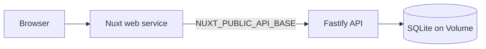

# Deploying on Railway

This app can run on [Railway](https://railway.com) as **two services** from the same repo:

| Service | Root directory | What it runs |
|---------|----------------|--------------|
| **API** | `api` | Fastify + SQLite (`better-sqlite3`) |
| **Web** | `web` | Nuxt 3 (SSR via Nitro) |

Use the `railway_deploy` branch (or merge it into `master`) for `railway.toml` files and production `start` scripts.

## Prerequisites

- A [Railway](https://railway.com) account
- This repo pushed to GitHub (or deploy via Railway CLI)
- Node **20+** (matches `README.md`)

## Quick overview



1. Deploy the **API** first and generate a public domain.
2. Set `NUXT_PUBLIC_API_BASE` on the **Web** service to that API URL.
3. Deploy **Web** and generate its public domain.

---

## Step 1 — Create a Railway project

1. Go to [railway.com/new](https://railway.com/new).
2. Choose **Deploy from GitHub repo** and select this repository.
3. If prompted for a single service, add a **second empty service** later (Project → **+ New** → **Empty Service**).

You should end with **two services** in one project, for example:

- `postgrad-api`
- `postgrad-web`

---

## Step 2 — Configure the API service

1. Open the API service → **Settings**.
2. **Root Directory**: `api`
3. **Watch Paths** (optional): `api/**`
4. **Networking** → **Generate Domain** (e.g. `postgrad-api-production.up.railway.app`).

### Environment variables (API)

| Variable | Value | Notes |
|----------|--------|--------|
| `HOST` | `0.0.0.0` | Required so Railway can reach the process |
| `DB_FILE` | `/data/postgrad-eval.db` | Use with a volume (below) |
| `PORT` | *(leave unset)* | Railway sets this automatically |

`PORT` and `HOST` are already read in `api/src/server.ts`.

### Persist SQLite with a Volume (recommended)

Without a volume, the database is **wiped on every redeploy**.

1. API service → **Settings** → **Volumes** → **Add Volume**
2. Mount path: `/data`
3. Set `DB_FILE=/data/postgrad-eval.db`

On first boot the API runs migrations and seeds four programs when the DB is empty.

### Build & start (Railpack)

The API uses **Railpack** (`builder = "RAILPACK"` in `api/railway.toml`). `api/railpack.json` pins **Node 20** and installs `python3`, `make`, and `g++` at build time so `better-sqlite3` can compile via `node-gyp` when no prebuilt binary exists for the detected Node version.

- **Build**: `npm ci && npm run build`
- **Start**: `npm start` → `node dist/server.js`
- **Health check**: `GET /health`

Verify: open `https://YOUR-API-DOMAIN/health` → `{"ok":true}`  
Programs: `https://YOUR-API-DOMAIN/api/programs`

---

## Step 3 — Configure the Web service

1. Open the Web service → **Settings**.
2. **Root Directory**: `web`
3. **Watch Paths** (optional): `web/**`

### Environment variables (Web)

Set **before** the next deploy/build (Nuxt bakes `NUXT_PUBLIC_*` into the client bundle):

| Variable | Example |
|----------|---------|
| `NUXT_PUBLIC_API_BASE` | `https://postgrad-api-production.up.railway.app/api` |

**Same-project reference** (replace service name with yours):

```bash
NUXT_PUBLIC_API_BASE=https://${{postgrad-api.RAILWAY_PUBLIC_DOMAIN}}/api
```

4. **Networking** → **Generate Domain** for the web app.
5. Trigger **Redeploy** on the web service after changing `NUXT_PUBLIC_API_BASE`.

### Build & start

From `web/railway.toml` / `package.json`:

- **Build**: `npm ci && npm run build`
- **Start**: `npm start` → `node .output/server/index.mjs`

Open the web domain → register → browse programs.

---

## Step 4 — Deploy order checklist

- [ ] API root directory = `api`
- [ ] API volume mounted at `/data`, `DB_FILE=/data/postgrad-eval.db`
- [ ] API public URL works (`/health`, `/api/programs`)
- [ ] Web root directory = `web`
- [ ] `NUXT_PUBLIC_API_BASE` points to API URL **with** `/api` suffix
- [ ] Web redeployed after env change
- [ ] Web public URL loads and login/register works

---

## Deploy from the `railway_deploy` branch

In each service **Settings** → **Source**:

- **Branch**: `railway_deploy`

Or merge `railway_deploy` into `master` and deploy `master`.

---

## CLI alternative

From the repo root (with [Railway CLI](https://docs.railway.com/guides/cli) installed):

```bash
railway login
railway init   # link to a new or existing project
```

Deploy API (from `api/`):

```bash
cd api
railway link    # select the API service
railway up
```

Deploy Web (from `web/`, after API URL is known):

```bash
cd web
railway link    # select the Web service
railway variables set NUXT_PUBLIC_API_BASE=https://YOUR-API-DOMAIN/api
railway up
```

---

## Troubleshooting

### Web shows “Failed to load programs” or network errors

- Confirm `NUXT_PUBLIC_API_BASE` ends with `/api` (no trailing slash after `api`).
- Redeploy **web** after changing the variable.
- In the browser devtools → Network, requests should go to the Railway API host, not `localhost:3001`.

### API build fails on `better-sqlite3` / `node-gyp`

- Confirm `api/railway.toml` uses `builder = "RAILPACK"` (not `NIXPACKS`).
- Confirm `api/railpack.json` exists with `buildAptPackages`: `python3`, `make`, `g++`.
- Railpack should use Node **20** via `packages.node` in `railpack.json` (avoids Node 24, which often lacks prebuilt `better-sqlite3` binaries).

### API crashes on start (`better-sqlite3`)

- Ensure Root Directory is `api` (not repo root).
- Redeploy after fixing the Railpack config so native modules compile on Linux during `npm ci`.

### Data disappears after redeploy

- Attach a volume at `/data` and set `DB_FILE=/data/postgrad-eval.db`.

### CORS errors

- The API enables `cors` with `origin: true`, so browser origins from your web domain are allowed. If you still see CORS issues, confirm the web app is calling the correct API URL (HTTPS, correct host).

### Health check fails (web)

- First Nuxt build can take several minutes; increase health check timeout in `web/railway.toml` or Railway settings if needed.

---

## Production limitations (unchanged from README)

- SQLite + single volume suits an eval/demo; production at scale would use Postgres.
- Bearer tokens in `localStorage` — see README tradeoffs.
- No email verification or password reset.

For architecture tradeoffs and future improvements, see the main [README.md](../README.md).
